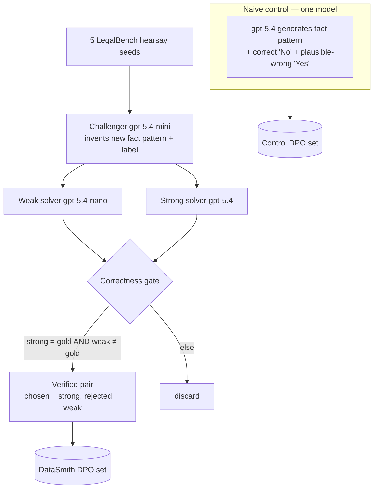
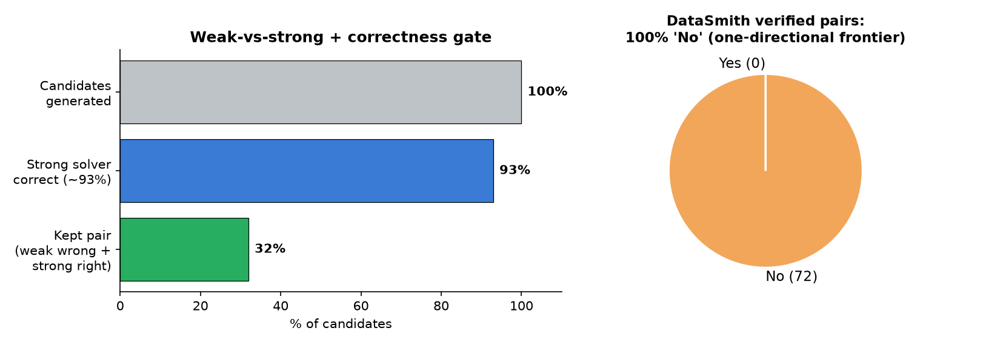
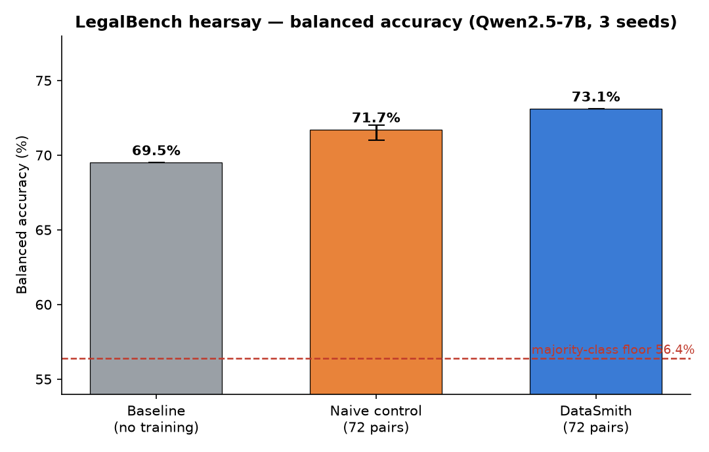
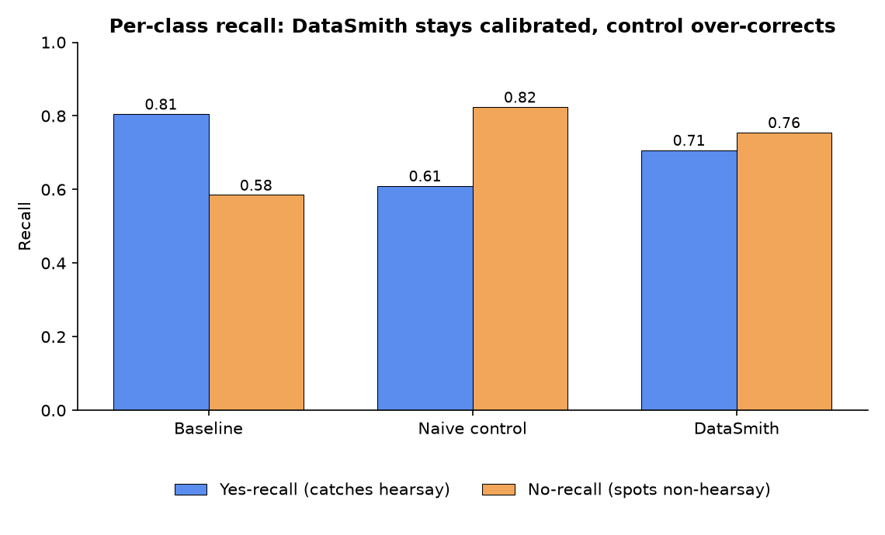
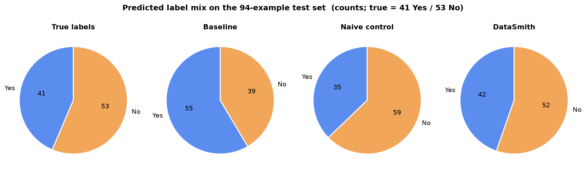

# LegalBench Hearsay: DataSmith vs. Naive Synthetic Data

This is a controlled benchmark of the DataSmith **weak-vs-strong** loop against a **naive
single-model** synthetic-data baseline, fine-tuning `Qwen2.5-7B-Instruct` and evaluating on the
LegalBench **hearsay** task. Unlike a baseline-vs-tuned comparison (which only measures
distillation), this isolates whether DataSmith's *data-generation method* adds value over simply
asking one strong model to generate the data.

> **Status:** This documents the **72-pair / 3-seed** experiment. A larger 393-pair run is in
> progress and intentionally **not** reported here.

## TL;DR

- On a fair, method-controlled comparison, DataSmith data gives a **small but consistent edge**:
  **+1.4 balanced-accuracy points** over the naive control (positive on every seed), and **+3.6**
  over the untuned baseline.
- The more interesting result is **calibration**: both arms trained on the same all-"No" data, but
  the naive control **over-corrected** (yes-recall collapsed 0.81 → 0.61), while **DataSmith stayed
  calibrated** (predicted 42 Yes / 52 No vs. the true 41 / 53).
- We found and reported a **bug in DataSmith's judge** (it rewards sophisticated-but-wrong answers);
  the data is only usable after adding a **correctness gate**. See
  [issue #11](https://github.com/Atharva-Kanherkar/datasmith/issues/11).

## Why hearsay, not GSM8K

An earlier pilot used GSM8K. GSM8K is **saturated** — modern instruction-tuned models already do it
well, so naive distillation captures most of the available gain and a curation method can't show its
value. The Autodata paper DataSmith implements evaluated on **legal reasoning, CS-research QA, and
math-object reasoning**, not GSM8K. LegalBench `hearsay` is a better fit: a closed-form,
**verifiable** rule-application task (Yes/No: is the statement hearsay?) where the base model has
real headroom and a *systematic* weakness.

- Test set: 94 examples, **53 No / 41 Yes** → majority-class floor **56.4%**.
- We report **balanced accuracy** (mean of per-class recall) and the **prediction distribution**, so
  a model that collapses to one label cannot masquerade as "good."

## Method

Both arms produce DPO preference pairs (`prompt`, `chosen`, `rejected`) and are trained with an
**identical** recipe; only the data source differs.



- **Correctness gate (our fix):** we do **not** trust the judge's "quality" verdict. We keep a pair
  only when the strong solver's answer matches the true label **and** the weak solver's does not —
  i.e. *verified* "weak fails, strong succeeds." All roles are pinned to the simplified hearsay
  definition (no admissibility exceptions) to match the benchmark's labeling convention.
- **Control:** one model (`gpt-5.4`) writes the fact pattern, the correct analysis (`chosen`), and a
  plausible-wrong analysis (`rejected`). No weak solver, no judge, no failure-frontier selection.
  Matched to DataSmith on **count (72)**, **label distribution (all "No")**, and **chosen model**.



The weak model only ever errs by **over-calling** hearsay, so the failure frontier is
**100% non-hearsay ("No")** — a one-directional result that holds even at larger scale.

## Setup

| Component | Value |
|---|---|
| Base model | `unsloth/Qwen2.5-7B-Instruct-bnb-4bit` |
| Roles | challenger `gpt-5.4-mini`, weak `gpt-5.4-nano`, strong `gpt-5.4`, judge `gpt-5.4-mini` |
| Train | DPO (QLoRA, r=16), 80 steps, lr 5e-5, β 0.1, seeds 13/21/42 |
| Eval | LegalBench `hearsay` test (94), fixed rule + 5-shot prompt, greedy, exact Yes/No match |
| Pairs / arm | 72 (DataSmith verified) vs. 72 (naive control) |

## Results

| Arm | Balanced acc | Accuracy | Yes-recall | No-recall | Pred mix (true 41Y/53N) |
|---|---|---|---|---|---|
| Baseline (no training) | 69.5% | 68.1% | 0.805 | 0.585 | 55Y / 39N |
| Naive control | 71.7% `[71.0, 72.0]` | 73.0% | 0.610 | 0.824 | 35Y / 59N |
| **DataSmith** | **73.1%** `[73.1, 73.1]` | 73.4% | 0.707 | 0.755 | 42Y / 52N |



**Both arms beat the baseline**, and DataSmith beats the control by **+1.4** balanced points
(per-seed deltas +2.0 / +1.1 / +1.1 — positive every seed).

### The real story is calibration

Both arms trained on 100% "No" data, so both fixed the baseline's weak spot (no-recall 0.585 → ~0.8).
But the naive control did it by **bluntly shifting toward "No"** — its yes-recall *crashed* and it
now predicts "No" far more than the truth warrants. DataSmith fixed the gap **without** breaking the
other direction.





The pie charts make it visual: DataSmith's prediction mix (42/52) tracks the true distribution
(41/53) closely; the control collapses toward "No" (35/59).

**Likely mechanism:** DataSmith's `rejected` answers are the weak model's *real* mistakes, so DPO
learns to avoid those specific error patterns. The control's `rejected` are a strong model's
*synthesized* "plausible wrong," which push a blunter "prefer No" shortcut. Failure-frontier
negatives appear to be **higher-quality preference data** — which is DataSmith's thesis.

## The judge bug

DataSmith's built-in judge accepts examples on perceived weak-vs-strong *quality*, not correctness.
On hearsay it repeatedly accepted pairs where the strong model applied admissibility exemptions the
benchmark doesn't use — making `chosen` **wrong** and `rejected` right. Training on that data
*degrades* the model. We worked around it with the correctness gate above and filed
[issue #11](https://github.com/Atharva-Kanherkar/datasmith/issues/11) with a suggested fix
(use the reference label / an optional verifier as an acceptance gate).

## Honest caveats

- **Small effect.** +1.4 balanced points ≈ 1–2 examples out of 94. The *direction* is consistent
  across seeds and the calibration story is robust, but this is a modest win, not a blowout.
- **What "3 seeds" did and didn't buy.** Eval is greedy and the 94-example test is coarse, so
  DataSmith's per-seed numbers were identical. We varied the *training* seed but not the two larger
  variance sources: the **generated data** (one generation per arm) and the **eval set**.
- **One-directional data.** Every pair is a "No" case (the weak model's only failure mode), so this
  probes a narrow slice of the rule.
- **Residual confound.** Both arms share the `chosen` model (`gpt-5.4`); the difference is the
  `rejected` source (real weak-model failures vs. synthesized) plus the failure-frontier selection.

## Reproduce

```bash
# charts
uv run --with matplotlib --with numpy python docs/benchmarks/make_hearsay_charts.py
```

Data generation uses the DataSmith SDK weak-vs-strong loop plus the correctness gate described
above; training/eval ran on a Kaggle T4 with the recipe in the Setup table.

## Future work

- A larger **393-pair** run (3 epochs) is in progress to test whether more data widens the gap.
  Early signal suggests **it does not** — more one-directional data drives over-fitting and erases
  the calibration edge — but those results are deferred to a follow-up.
- Generate **two-directional** data (also capture true-"Yes" failures) so training isn't biased
  toward "No". This requires a weak solver that errs in both directions.
- Add more LegalBench rule-application tasks and report variance across **data-generation** seeds.
